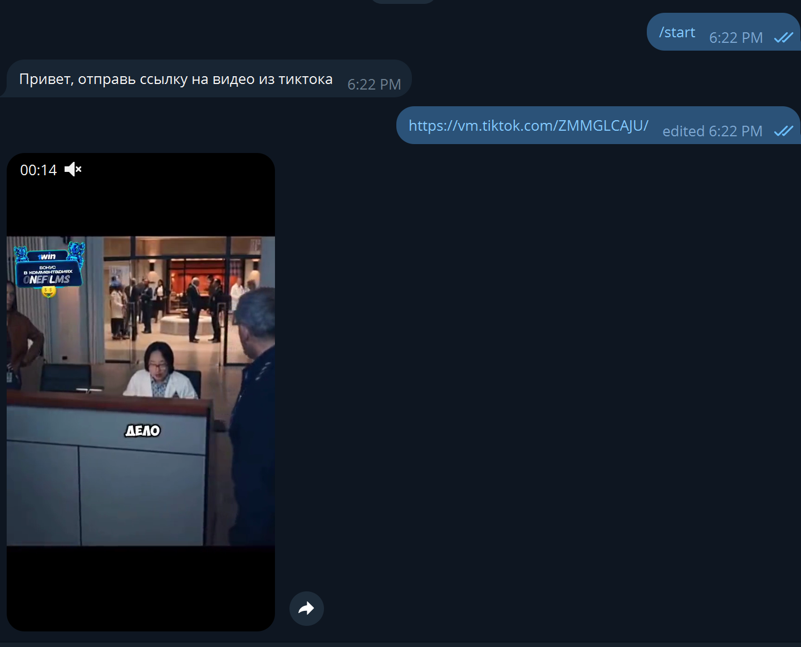

# Tiktok_bot
Бот который присылает видео без водяных знаков.

Он принимает ссылку и присылает видео.

## запуск бота
создание виртуальной среды
```bash
python -m venv venv
```
активация виртуальной среды
```bash
.\venv\Scripts\activate
```
установка зависимостей
```bash
pip install -r requirements.txt
```
запуск
```bash
py app.py
```


## Cтруктура бота
**.env**	настройки бота

**app.py** Главный файл запуска бота

**video_processing\ 
	titktok_no_watermark.py** скрипт получения ссылки на видео без водяных знаков

**handlers\ 
	message_handlers.py**	обработчики сообщений в боте


## Работа бота
